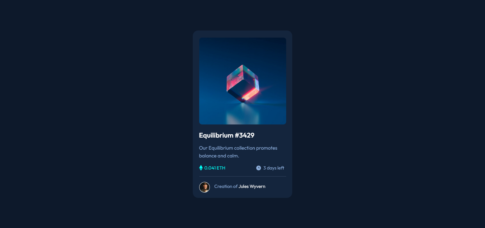

# Frontend Mentor - NFT preview card component solution

This is a solution to the [NFT preview card component challenge on Frontend Mentor](https://www.frontendmentor.io/challenges/nft-preview-card-component-SbdUL_w0U). Frontend Mentor challenges help you improve your coding skills by building realistic projects. 

## Table of contents

- [Overview](#overview)
  - [The challenge](#the-challenge)
  - [Screenshot](#screenshot)
  - [Links](#links)
- [My process](#my-process)
  - [Built with](#built-with)
  - [What I learned](#what-i-learned)
  - [Continued development](#continued-development)
  - [Useful resources](#useful-resources)
- [Author](#author)
- [Acknowledgments](#acknowledgments)

## Overview

This challenge allows me to improve my html and css skills, so I thank the frontend mentor for putting real challenges, which makes us keep improving.

### The challenge

Users should be able to:

- View the optimal layout depending on their device's screen size
- See hover states for interactive elements

### Screenshot



### Links

- Solution URL: [Repository GitHub](https://github.com/GiSofia/NFTComponent)
- Live Site URL: [GitHub](https://gisofia.github.io/NFTComponent/)

## My process

### Built with

- Semantic HTML5 markup
- CSS custom properties
- Flexbox
- CSS Grid


### What I learned

I'm highlighting this section because I need to keep practicing the flexbox grid and the properties it provides.

```css
.author-card{
    display: flex;
    justify-content: flex-start;
    align-items: center;
    margin-top: 12px;
    border-top: 1px solid var(--Dark-blue-line);
    margin-bottom: 15px;
}
```

### Continued development

I would like to continue learning more about CSS, to know its properties very well, as well as to practice the Grid and Flexbox themes more.

### Useful resources

- [CSS Tricks](https://css-tricks.com/snippets/css/complete-guide-grid/) - This website helped me a lot with the CSS grid theme, I highly recommend it.

## Author

- Website - [Giuliana Saborío](https://gisofia.github.io/portfolio/)
- Frontend Mentor - [@GiSofia](https://www.frontendmentor.io/profile/GiSofia)

## Acknowledgments

I did this challenge alone, without anyone's help, more than the resources I occupied.
